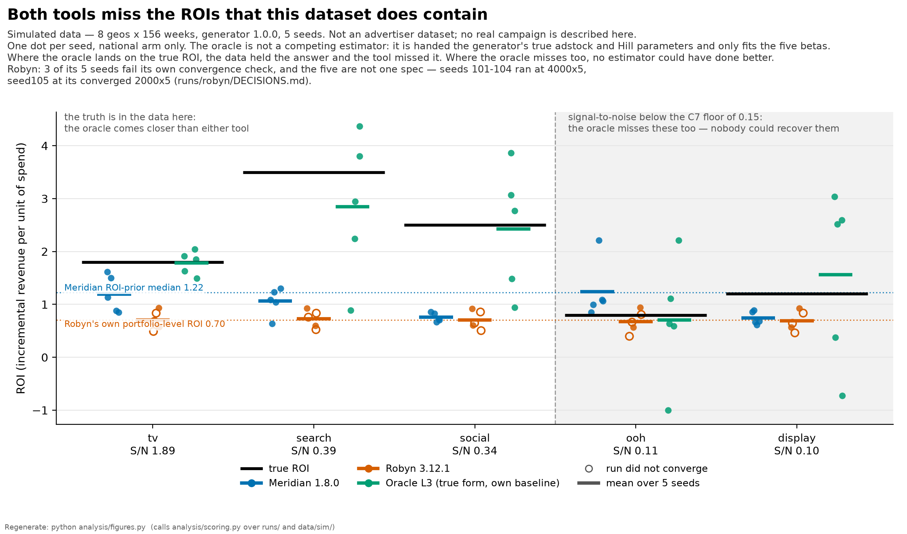

# Meridian vs Robyn, on data whose answer is known

**The dataset here is simulated.** No advertiser data, no employer data, nothing real.
A committed generator writes every channel's true ROI, adstock and response curve to
disk *before* either tool sees the data — which buys a question real data cannot ask:
not "do the two tools agree?" but **"which one recovered reality — and was reality
recoverable at all?"**

Google **Meridian 1.8.0** (Python, Bayesian MCMC) and Meta **Robyn 3.12.1** (R, ridge
regression driven by Nevergrad) ran over the same five seeds of the same simulated
panel — 5 channels, 8 geos, 156 weeks. The harness, the metrics and Robyn's model
selection rule were all committed before the first run.

This is a comparison of two tools and a reading of what they can and cannot tell you.
It is not a production marketing-mix model, and nothing here is offered as one.

📄 **[Read the article](article/meridian-vs-robyn.md)** (~1,300 words) — the full argument.

---

## The short answer

**There is no winner.** On the like-for-like national arm the two tools tie, and both
miss badly:

| arm | mean \|ROI error\| | interval covers truth | interval width / true ROI |
|---|---|---|---|
| Meridian — national, 5 seeds | 0.533 | 60% (nominal 90%) | 1.615 |
| Robyn — national, 5 seeds | 0.555 | 16% — **not a posterior, not comparable** | 0.277 |
| Meridian — geo, 2 seeds | 0.499 | 50% | 1.196 |
| **Oracle** — national, true parameters | 0.432 | 88% | 1.338 |
| **Oracle** — national, estimated baseline | 0.598 | 92% | 2.753 |

*Every cell above is read from [`analysis/out/summary.md`](analysis/out/summary.md), which
`analysis/scoring.py` regenerates from the committed inputs.*

The last two rows are the point. The **oracle** is an estimator that cheats: it is handed
the generator's functional form and the true adstock and Hill parameters, and fits only
five coefficients. Nobody can run one on real data. It exists to separate *the tools
failed* from *the data could not answer* — and it says both are true, per channel:

| channel | signal / noise | oracle err | Meridian err | Robyn err |
|---|---|---|---|---|
| tv | 1.91 | **0.04** | 0.34 | 0.61 |
| search | 0.39 | **0.15** | 0.70 | 0.79 |
| social | 0.34 | **0.24** | 0.70 | 0.72 |
| ooh | 0.11 | 0.97 | 0.55 | 0.23 |
| display | 0.10 | 0.76 | 0.38 | 0.43 |

*Mean absolute relative ROI error on simulated data, national arm, five seeds; the oracle
column is the rung handed the true baseline. Signal-to-noise is each channel's true
contribution against the revenue noise, both as standard deviations, from
[`analysis/out/diagnostics.md`](analysis/out/diagnostics.md).*



For **tv, search and social** the truth is in the data and neither tool found it. For
**ooh and display** the truth is not in the data at all — and both tools report those two
with the same apparent confidence as the rest. Robyn's own error column ranks ooh as its
*best* channel; the truth is the reverse.

**Which tool to use is conditional** — uncertainty you can act on, geographic variation,
an allocation finance will sign off on, runtime, and maintenance risk each point
differently. The [article's decision guide](article/meridian-vs-robyn.md#which-one-should-you-use)
lays out the five conditions. And the [mandatory limitations
section](article/meridian-vs-robyn.md#what-neither-tool-can-tell-you) — what neither tool
can tell you — is not an appendix; it is half the result.

---

## Reproduce it

Two layers, and only the first is needed to check every number published here.

### Layer 1 — the analysis (no GPU, no R, no admin rights)

The simulator, the oracle, the scoring harness and the figures run on plain CPython.
The committed tool outputs in `runs/*/results/` are their inputs, so this layer
regenerates **every published number and figure** without installing Meridian or Robyn.

```bash
git clone https://github.com/IgorLima-py/mmm-meridian-vs-robyn.git
cd mmm-meridian-vs-robyn
python -m venv .venv
. .venv/bin/activate             # Windows: . .venv/Scripts/activate
python -m pip install -r envs/analysis.lock.txt

python -m simulation.generate    # writes data/sim/seed10{1..5}/
python -m simulation.checks      # sanity gates C1-C7, must exit 0
python analysis/oracle.py        # the four oracle rungs -> runs/oracle/results/
python analysis/scoring.py --results runs --data data/sim --out analysis/out

python analysis/oracle.py --diagnostics   # -> analysis/out/diagnostics.md
python analysis/figures.py                # re-scores, redraws analysis/figures/
```

The first four are the gates; the last two rebuild the other two published artifacts —
the scenario diagnostics the signal-to-noise column comes from, and the three figures.
`--diagnostics` replaces the fit rather than adding to it, which is why it is a separate
invocation.

**Verified, not asserted.** On 2026-09-10 this sequence was run against a clone into an
empty directory, in a virtualenv built from scratch containing nothing but
`envs/analysis.lock.txt` and pip — neither model environment installed in it, and nothing
in the sequence touching WSL2, R or a GPU. All six commands exit 0 in **under 15 seconds
total**, and every regenerated tracked artifact — the 20 data files, the 20 oracle JSONs,
`analysis/out/summary.md`, `analysis/out/diagnostics.md` and all three PNGs — came back
identical to the committed copies.

One caveat on "identical": on Windows the generator writes CRLF while git stores these
files with LF (`.gitattributes`), so `git status` lists the CSVs as modified after a
regeneration. The *content* is byte-identical — `git diff --ignore-cr-at-eol --quiet`
returns 0. That is the honest form of the determinism claim.

### Layer 2 — re-running the tools themselves

Only needed to reproduce `runs/meridian/results/` and `runs/robyn/results/` from scratch.
Both environments live in **WSL2 Ubuntu** on a GPU desktop and are fully scripted; see
[`envs/ENVIRONMENT.md`](envs/ENVIRONMENT.md) for the setup, the host spec, and an
eight-entry friction log of what actually broke.

```bash
sudo bash envs/apt_base.sh
bash envs/setup_meridian.sh      # google-meridian[and-cuda]==1.8.0 in ~/venvs/meridian
bash envs/setup_robyn.sh         # Robyn from CRAN + nevergrad in a pinned 3.10 venv

python runs/meridian/run_meridian.py --arm national --seeds 101 102 103 104 105
python runs/meridian/run_meridian.py --arm geo --seeds 101 102 --n-adapt 2000 --n-burnin 2000
Rscript runs/robyn/run_robyn.R --iterations=4000 101 102 103 104
Rscript runs/robyn/run_robyn.R --iterations=2000 105
```

Those are the exact specs the committed extracts came from, mixed spec included: the
national Meridian arm at the script's pre-registered 500/500 defaults, the geo arm at
four times that, and Robyn's seed 105 at 2000×5 where the other four were escalated to
4000×5. Never pass `quiet` to Robyn — it crashes 3.12.1 (friction F8).

Meridian is unsupported on native Windows; Robyn runs there but single-core, which is why
WSL2. Mean runtime per national run: **432 s** for Meridian on a consumer GPU, **1017 s**
for Robyn multi-core (that mean blends two specs — see below).

---

## Versions

| Component | Version | Notes |
|---|---|---|
| google-meridian | **1.8.0** | full tree pinned in [`envs/meridian.lock.txt`](envs/meridian.lock.txt) |
| tensorflow | 2.21.0 | pulled by `google-meridian[and-cuda]` |
| tfp-nightly | **0.26.0.dev20260130** | see the pin oddity below |
| Robyn | **3.12.1** (CRAN, 2025-07-02) | recorded, **not** reproducibly pinned — below |
| R | 4.5.2 | Ubuntu 26.04 repo |
| nevergrad | 1.0.12 | [`envs/nevergrad.lock.txt`](envs/nevergrad.lock.txt) |
| Python (Meridian) | 3.12.14 | uv-managed; Ubuntu 26.04's system Python is too new for 1.8.0 |
| Python (nevergrad) | 3.10.21 | uv-managed, pinned via `RETICULATE_PYTHON` |
| Python (analysis) | 3.14.3 | numpy 2.4.3, pandas 3.0.1, matplotlib 3.11.1 — [`envs/analysis.lock.txt`](envs/analysis.lock.txt) |
| CUDA stack | runtime 12.9.0, cuDNN 9.24.0 | from pip wheels, no toolkit install |
| OS for the runs | Ubuntu 26.04 LTS under WSL2 on Windows 11 | GPU: NVIDIA RTX 4070 SUPER, 12 GB |

**The tfp-nightly pin, and its risk.** Meridian 1.8.0 does not depend on a released
TensorFlow Probability. It hard-pins a *nightly* build — `tfp-nightly==0.26.0.dev20260130`
— and nightlies are not a stable distribution channel: they can be yanked, and nothing
promises this exact dev build stays fetchable. If it disappears, `envs/setup_meridian.sh`
stops reproducing the environment these results came from, and no amount of care on this
side prevents it. It is recorded here so the failure is recognizable rather than
mysterious. Meridian **2.0.0** shipped 2026-09-03 — after these runs — and moves the
default backend from TensorFlow to JAX, so re-running on the current release is a
different experiment, not a check of this one.

**Where "pinned" stops being true.** The Python side is genuinely pinned: those lock files
are inputs you install *from*. The R side is not. `envs/setup_robyn.sh` calls
`install.packages("Robyn")` with no version, and it *writes* `envs/nevergrad.lock.txt`
from whatever pip resolved rather than installing from it. Those two files **record** an
environment; they do not reproduce one. A setup today would take whatever CRAN currently
serves. The run JSONs carry the resolved version (3.12.1), and closing the gap is tracked
in [`docs/BACKLOG.md`](docs/BACKLOG.md). Stated, not silent.

---

## What's in here

| Path | What it is |
|---|---|
| [`article/`](article/meridian-vs-robyn.md) | the piece — setup, results, decision guide, limitations |
| [`simulation/`](simulation/) | the generator; [`config.py`](simulation/config.py) is the single source of truth for every true parameter |
| [`data/`](data/README.md) | the five seeds, plus the generating process written out |
| [`runs/`](runs/) | run scripts, the committed result extracts, and a `DECISIONS.md` per tool — every setup choice, dated, including the ones that flatter each tool |
| [`analysis/`](analysis/) | scoring harness, the [oracle ladder](analysis/ORACLE.md), the pre-registered [selection rule](analysis/SELECTION_RULE.md), figures |
| [`analysis/out/summary.md`](analysis/out/summary.md) | the provenance every published number cites |
| [`envs/`](envs/ENVIRONMENT.md) | setup scripts, lock files, host spec, friction log |
| [`docs/`](docs/PLAN.md) | the plan and its decision log, references, deviations |

Heavy model-run outputs are not committed — only the small extracts in `runs/*/results/`.

---

## Scope, honestly

One simulated scenario. Exogenous spend — no budget chasing demand, no targeting
feedback, which is the *easy* regime and flatters both tools. Five fixed seeds. One
pinned version of each tool, each run once under one pre-registered setup. Constant
effectiveness over 156 weeks.

Two caveats travel with every Robyn number: three of five seeds fail Robyn's own
convergence check even at double the pre-registered iterations, and the five-seed means
blend two specs (seeds 101-104 at 4000×5, seed 105 at its converged 2000×5).
Symmetrically, Meridian's geo arm ran at four times its pre-registered sampler spec and
carries far more divergent transitions than the national arm. Both are logged in
`runs/*/DECISIONS.md`.

None of this is evidence about other scenarios, about endogenous spend, or about real
data. It is evidence about what these two tools did to *this* dataset, whose answer was
known in advance.
